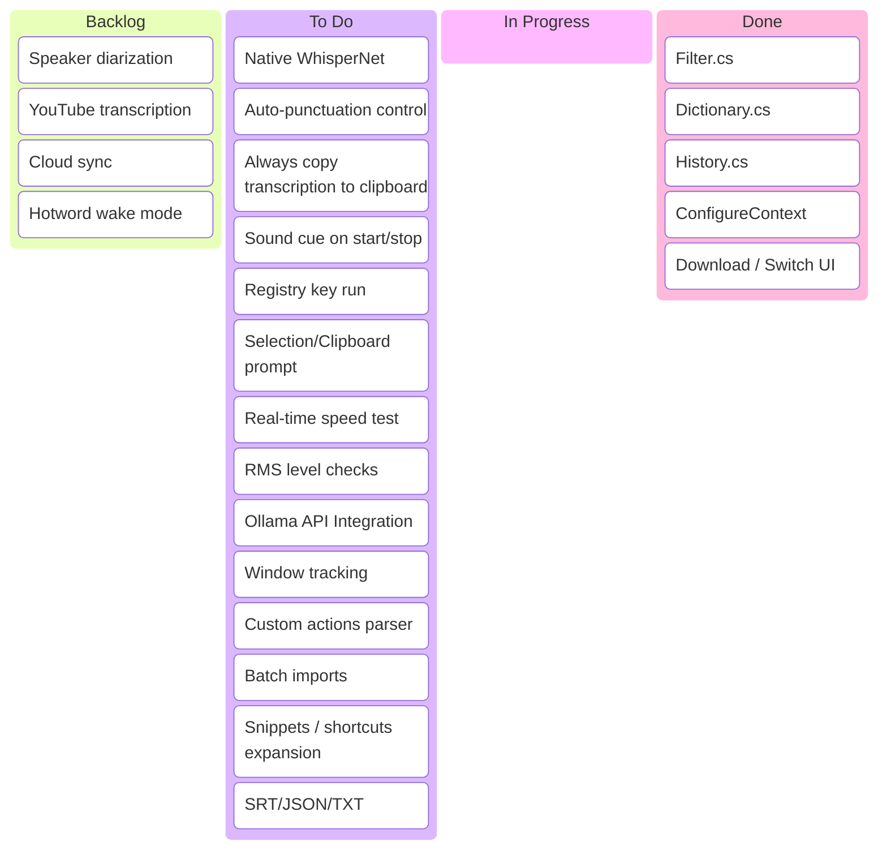

# WhisperTyper Feature Board & Roadmap

This document serves as our project roadmap and Kanban board for WhisperTyper. It maps the current state of features, categorizes them according to the product breakdown, provides technical implementation strategies for the WPF/C# codebase, and outlines potential choices for next steps.

---

## 📊 Current Feature Audit

We have analyzed the WhisperTyper codebase (`v0.6.0`). Here is how it stacks up against the target feature set:

### Free / Core Features
| Feature | Target Spec | Current State | Technical File / Location |
| :--- | :--- | :--- | :--- |
| **Filler word removal** | Strip "um", "uh", "like", "you know" | **✅ Done** | [FillerWordFilter.cs](file:///c:/Source/Repos/WhisperTyper/FillerWordFilter.cs) |
| **Custom dictionary** | User-defined words/phrase replacements | **✅ Done** | [DictionaryService.cs](file:///c:/Source/Repos/WhisperTyper/DictionaryService.cs) |
| **History log** | Searchable list, copy/re-type/delete | **✅ Done** | [HistoryService.cs](file:///c:/Source/Repos/WhisperTyper/HistoryService.cs) |
| **Language selection** | Session quick-switch without reload | **✅ Done** | [MainWindow.xaml.cs:L538-548](file:///c:/Source/Repos/WhisperTyper/MainWindow.xaml.cs#L538-L548) |
| **Auto-punctuation control** | Toggle punctuation additions | **❌ Not Started** | *New feature required* |
| **Startup with Windows** | Run in system tray on login | **❌ Not Started** | *New feature required* |
| **Audio feedback** | Sound cue on recording start/stop | **❌ Not Started** | *New feature required* |
| **Silence timeout** | Auto-stop recording after silence | **❌ Not Started** | *New feature required* |
| **Transcription clipboard copy**| Auto-copy final output to clipboard | **❌ Not Started** | *New feature required* |

---

### Premium Features
| Feature | Target Spec | Current State | Technical Complexity |
| :--- | :--- | :--- | :--- |
| **AI text cleanup** | Post-process with local LLM (Ollama) | **❌ Not Started** | Medium (Requires HTTP integration) |
| **Voice commands** | Triggers (e.g., "new paragraph", "delete") | **❌ Not Started** | Medium (Text parser + keystroke emulator) |
| **Per-app profiles** | App-specific model/lang/hotkey | **❌ Not Started** | Medium (Win32 foreground window hooks) |
| **File & audio transcription** | Drag-and-drop batch transcription | **❌ Not Started** | Medium (WPF DragDrop + batch tasks) |
| **Translation mode** | Transcribe foreign tongue -> English text | **❌ Not Started** | **Low** (Supported natively by WhisperNet!) |
| **Speaker diarization** | Label speakers in meeting notes | **❌ Not Started** | High (Heavy client-side ML requirements) |
| **Snippets / shortcuts** | Expand keyword (e.g., "my email" -> address) | **❌ Not Started** | Low (DictionaryService extension) |
| **Export formats** | SRT, VTT, JSON, plain text exports | **❌ Not Started** | Low (File serializer utility) |
| **YouTube URL transcription** | Paste URL -> get transcript | **❌ Not Started** | Medium (yt-dlp wrapper or extraction) |
| **Cloud sync** | Sync history/dictionary across PCs | **❌ Not Started** | Medium (REST API/OAuth or file sync) |

---

### Unique Angles
| Feature | Target Spec | Current State | Technical File / Location |
| :--- | :--- | :--- | :--- |
| **Model manager** | Download and switch GGML models | **✅ Done** | [ModelManager.cs](file:///c:/Source/Repos/WhisperTyper/ModelManager.cs) |
| **GPU benchmark mode** | Show real-time inference speed (tokens/sec) | **❌ Not Started** | Medium (Planned in [SPEC.md](file:///c:/Source/Repos/WhisperTyper/SPEC.md#L308-L349)) |
| **Hotword wake mode** | Always-on listening via trigger word | **❌ Not Started** | High (Needs local wake word engine) |
| **Context window injection** | Feed selected text / clipboard as prompt | **❌ Not Started** | Low (Whisper prompt injection) |

---

## 📋 Kanban Board



---

## 🛠️ Technical Implementation Strategies for "To Do" Items

Below are blueprints for how to integrate the highest-priority "To Do" candidates into WhisperTyper's WPF/C# architecture.

### 1. Translation Mode (Native WhisperNet Support)
* **Goal**: Allow users to speak in a foreign language and automatically type the English translation at their cursor.
* **Why it's a quick win**: Const-me's WhisperNet already includes direct support for this via the translation flag.
* **Implementation Plan**:
  - Add a **"Translate to English"** CheckBox in `MainWindow.xaml` under the Main panel.
  - Bind it to settings saving/loading.
  - In [WhisperController.cs:L136-144](file:///c:/Source/Repos/WhisperTyper/WhisperController.cs#L136-L144), update `ConfigureContext` to accept a `bool translate` parameter and pass it to:
    ```csharp
    _context.parameters.setFlag(eFullParamsFlags.Translate, translate);
    ```
  - Re-configure context dynamically when the checkbox is toggled.

### 2. Auto-Punctuation Control
* **Goal**: Toggle whether Whisper includes punctuation (periods, commas, capitalization) in the typed text.
* **Implementation Plan**:
  - Add a **"Punctuation & Formatting"** option in settings: `Strip Punctuation` or `Keep Punctuation`.
  - If punctuation is disabled, we can use a Regex post-processor filter in `WhisperController.cs` (applied in `StopRecordingAsync` and the partial loop) to strip punctuation characters: `[.,\/#!$%\^&\*;:{}=\-_`~()?]` and convert text to lowercase (if full format removal is desired).

### 3. Always Copy Transcription to Clipboard
* **Goal**: Put the transcribed text in the system clipboard in addition to simulating key presses at the cursor.
* **Implementation Plan**:
  - Add a **"Copy to Clipboard"** CheckBox to settings.
  - When transcription finishes in [MainWindow.xaml.cs:L504-512](file:///c:/Source/Repos/WhisperTyper/MainWindow.xaml.cs#L504-L512):
    ```csharp
    if (Settings.AlwaysCopyToClipboard)
    {
        System.Windows.Clipboard.SetText(transcription);
    }
    ```

### 4. Audio Feedback (Sound cue on start/stop)
* **Goal**: Give the user a clear audio confirmation when recording starts (hotkey held) and stops (hotkey released).
* **Implementation Plan**:
  - Bundle two subtle, short audio cues (e.g., standard wav files) as Embedded Resources or download/reference standard system sounds (e.g., `System.Media.SystemSounds.Beep`).
  - Use `System.Media.SoundPlayer` to play the start cue asynchronously in `StartRecording` and the stop cue in `StopRecordingAsync`.

### 5. Startup with Windows
* **Goal**: Add a checkbox "Start WhisperTyper when Windows starts".
* **Implementation Plan**:
  - Use the registry key `HKEY_CURRENT_USER\Software\Microsoft\Windows\CurrentVersion\Run`.
  - When checked, add `WhisperTyper` value pointing to `Environment.ProcessPath`.
  - When unchecked, delete the value.

### 6. Silence Timeout
* **Goal**: Automatically stop recording after $N$ seconds of silence.
* **Implementation Plan**:
  - In `WasapiCapture`'s `DataAvailable` event callback ([WhisperController.cs:L163-167](file:///c:/Source/Repos/WhisperTyper/WhisperController.cs#L163-L167)), compute the Root Mean Square (RMS) or peak amplitude of the incoming audio buffer chunk.
  - If the peak level drops below a configurable threshold (e.g., `< 0.01` for float formats), count the duration.
  - If the duration exceeds $N$ seconds, call `StopRecordingAsync` automatically and trigger a state transition.

### 7. GPU Benchmark Mode (Planned in SPEC)
* **Goal**: Allow users to run a speed test against downloaded models to recommend the best option.
* **Implementation Plan**:
  - Add a "Benchmark" button in the Models Manager tab.
  - When clicked, load a bundled 10-second WAV audio sample from resources.
  - Measure the exact time (in milliseconds) it takes for `_context.runFull()` to transcribe the sample.
  - Persist results in `settings.json` and display performance (e.g., `2.5× realtime speed`) in the UI.

---

## 🎯 Next Steps Recommendation

Based on effort-to-value ratio, we recommend starting with one of the following bundles:

1. **Bundle A: Quick Wins & Table Stakes (Free/Core)**
   - *Translation Mode* (uses native Whisper translation flag)
   - *Auto-Copy to Clipboard*
   - *Audio Feedback (Sound Cues)*
   - *Startup with Windows*

2. **Bundle B: Performance & UX (Unique / Spec Features)**
   - *GPU Benchmark Mode* (already partially planned in `SPEC.md`)
   - *Silence Timeout* (preventing run-away recordings)

3. **Bundle C: Premium Integrations**
   - *AI Text Cleanup via Ollama* (local LLM integration)
   - *Snippets / Shortcuts expansion*
